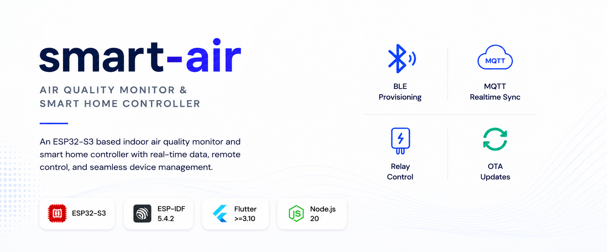
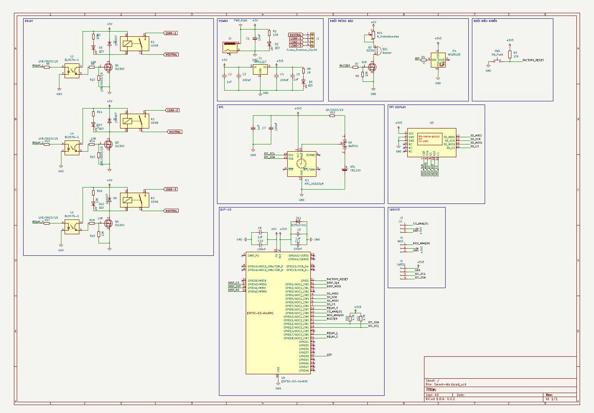
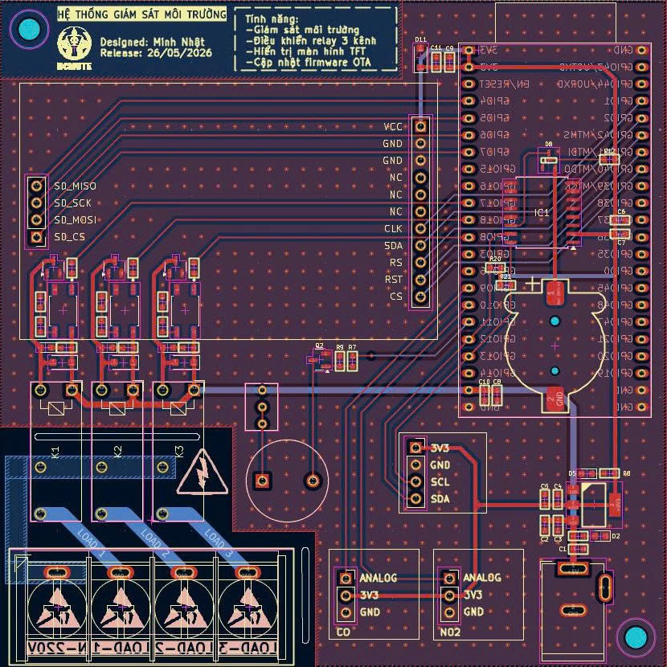
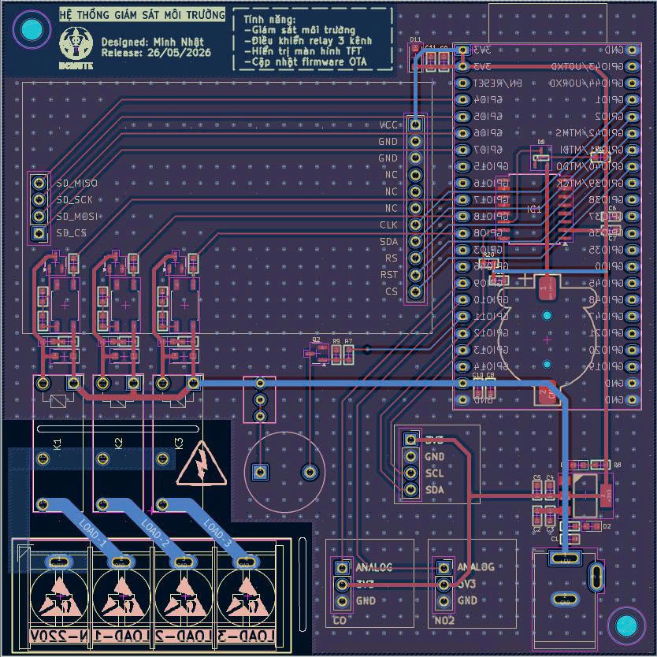
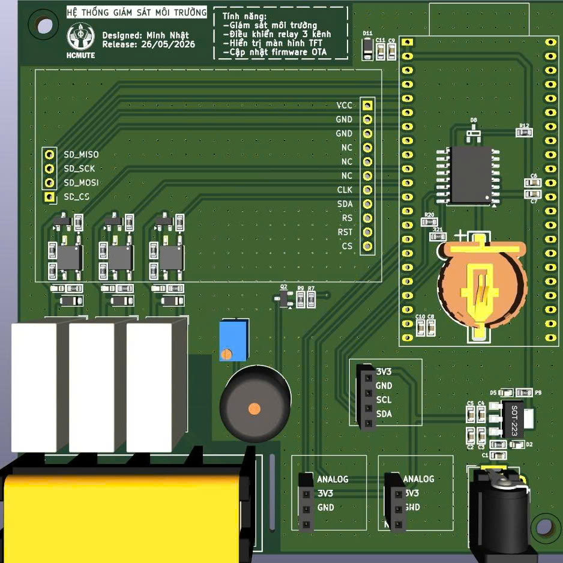
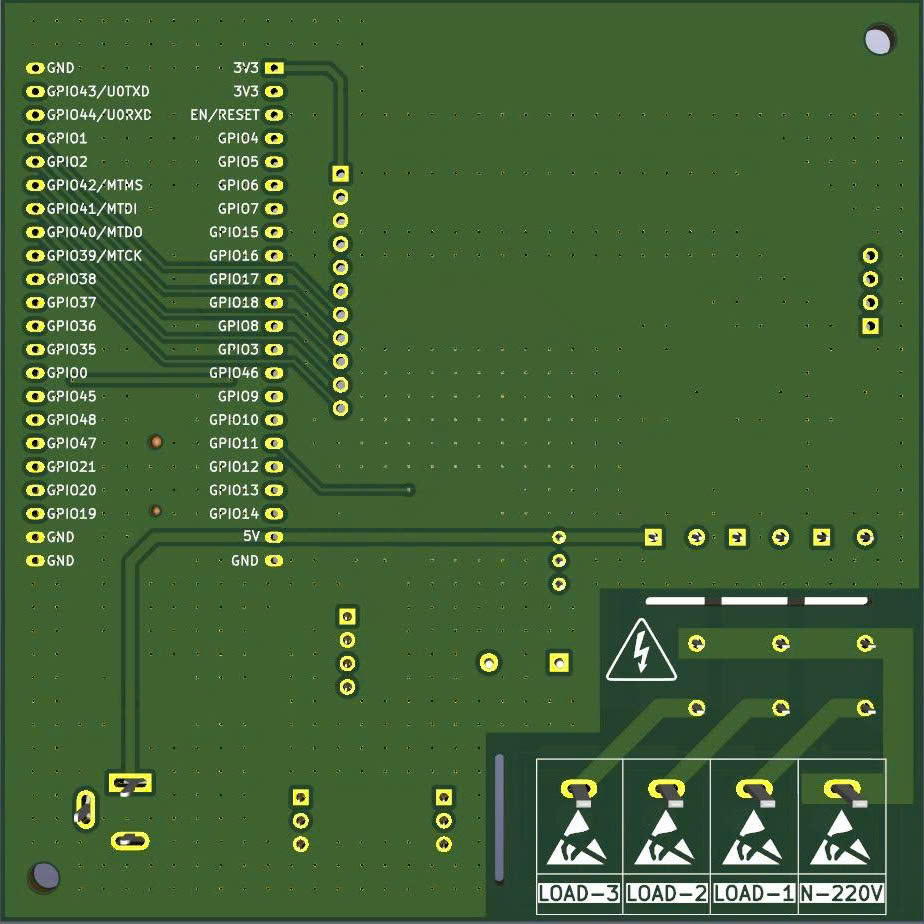
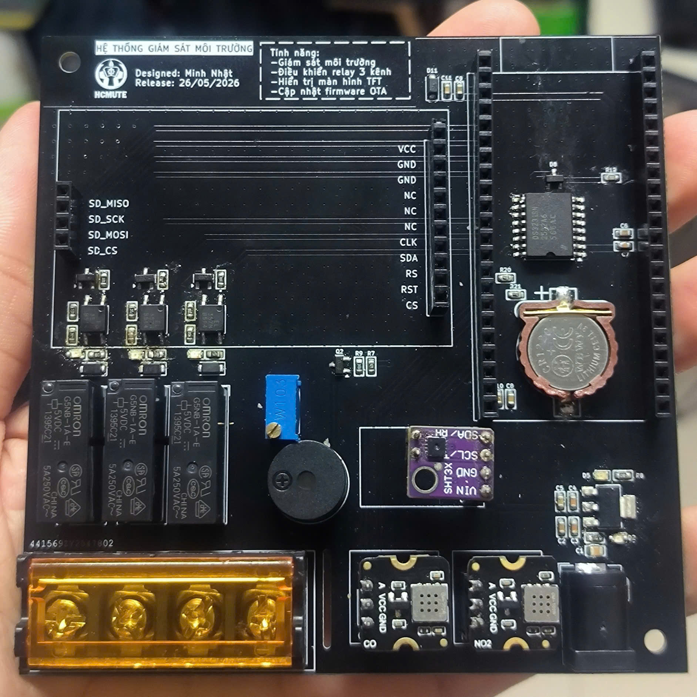
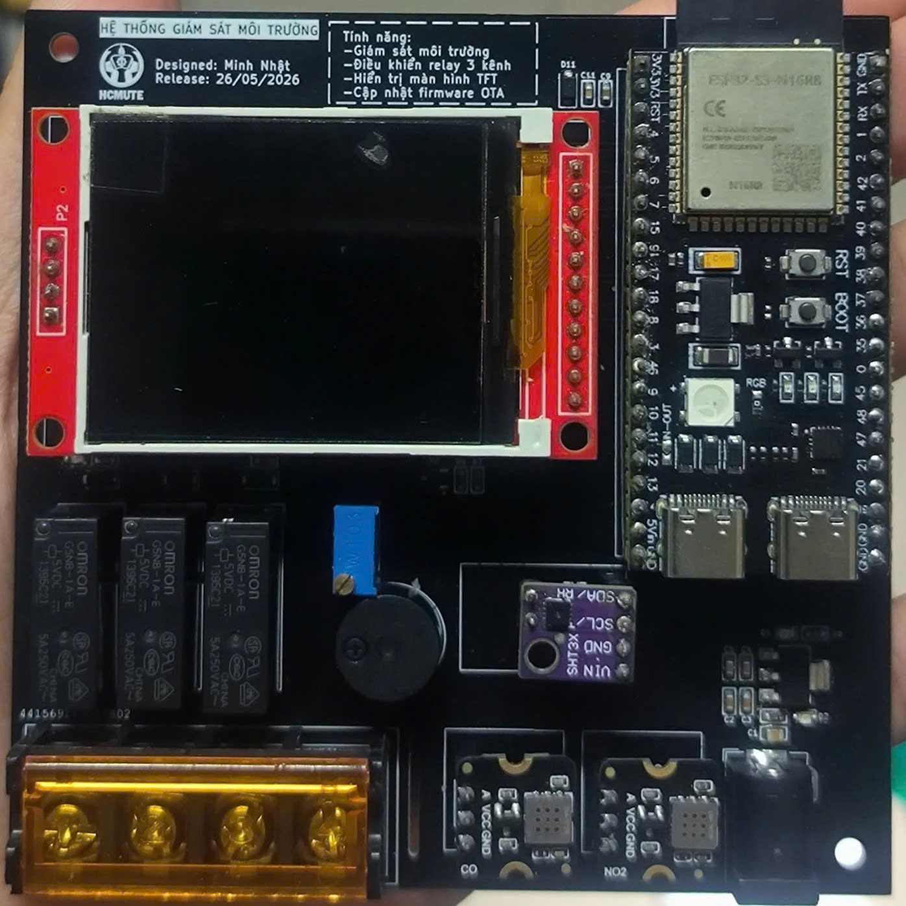
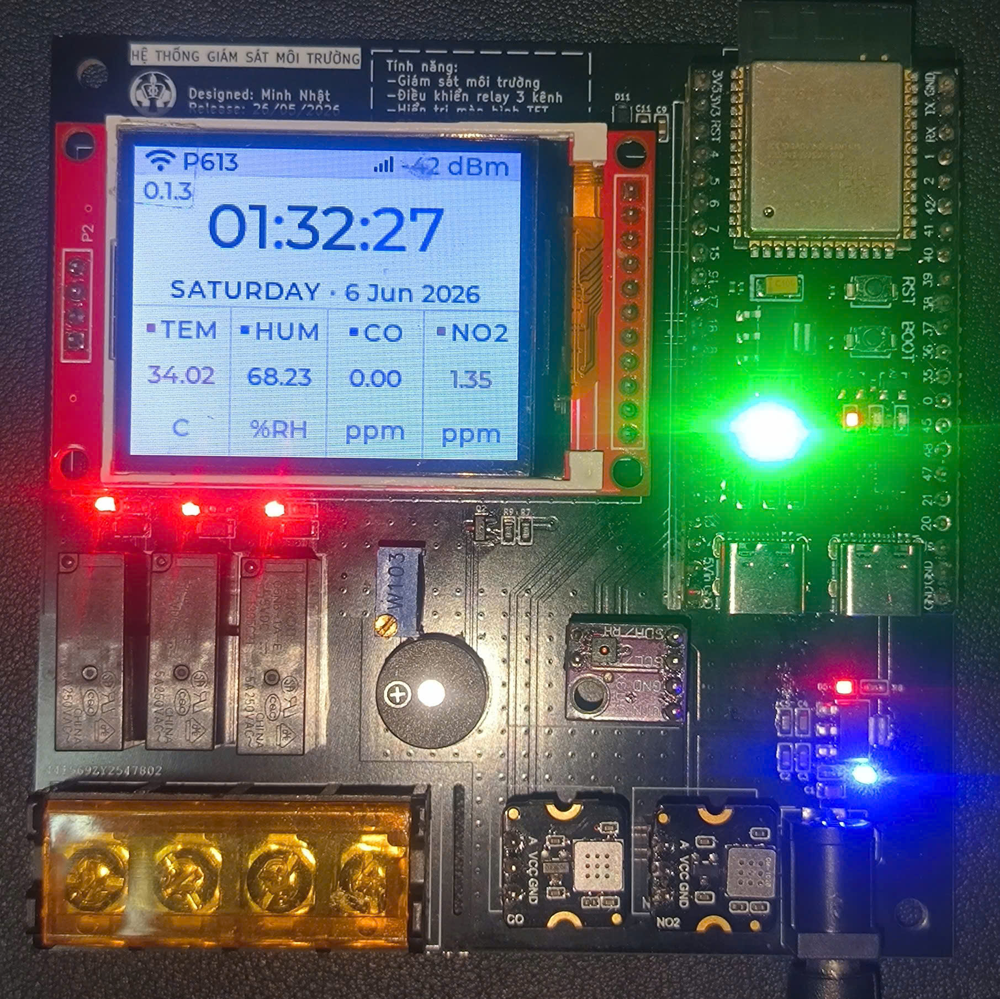

# smart-air

## Introduction

`smart-air` is an ESP32-S3 indoor air quality monitor and smart home controller. It combines ESP-IDF firmware, a Fastify + EMQX + PostgreSQL/TimescaleDB server stack, and a Flutter mobile app to solve device onboarding, telemetry ingestion, remote control, and live state sync in one system.

The device uses BLE for Wi-Fi provisioning, then publishes telemetry and shadow updates over MQTT. The app uses REST for snapshots, history, commands, and provisioning steps, and receives live updates from the API over Server-Sent Events at `GET /api/realtime`.

## Features

- ESP32-S3 firmware on ESP-IDF with BLE provisioning, Wi-Fi, MQTT, OTA hooks, sensor polling, display control, and relay control.
- Fastify API with PostgreSQL/TimescaleDB, Redis, and EMQX in Docker Compose.
- Device registration flow that provisions per-device MQTT credentials through the API.
- Realtime app updates over SSE, with REST kept as the canonical path for snapshots, history, replay, and fallback.
- Flutter app with Riverpod state management, auth flow, provisioning flow, device dashboards, and telemetry/history views.

## Hardware

### Schematic

### PCB Layout

  
  

### 3D Model

  
  

### Assembly

  
  
  

## Firmware

### Config and build

  
  

### Runtime

## Contributing

- Read [AGENTS.md](AGENTS.md) before making changes.
- For structural work, also read `docs/ARCHITECTURE.md`, `docs/MQTT_PROTOCOL.md`, and `docs/API_REFERENCE.md`.
- Keep changes narrow, update matching docs when contracts change, and run the narrowest verification for the area you touched.

## License

MIT. See [LICENSE.md](LICENSE.md).
