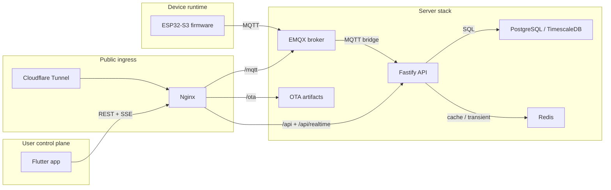
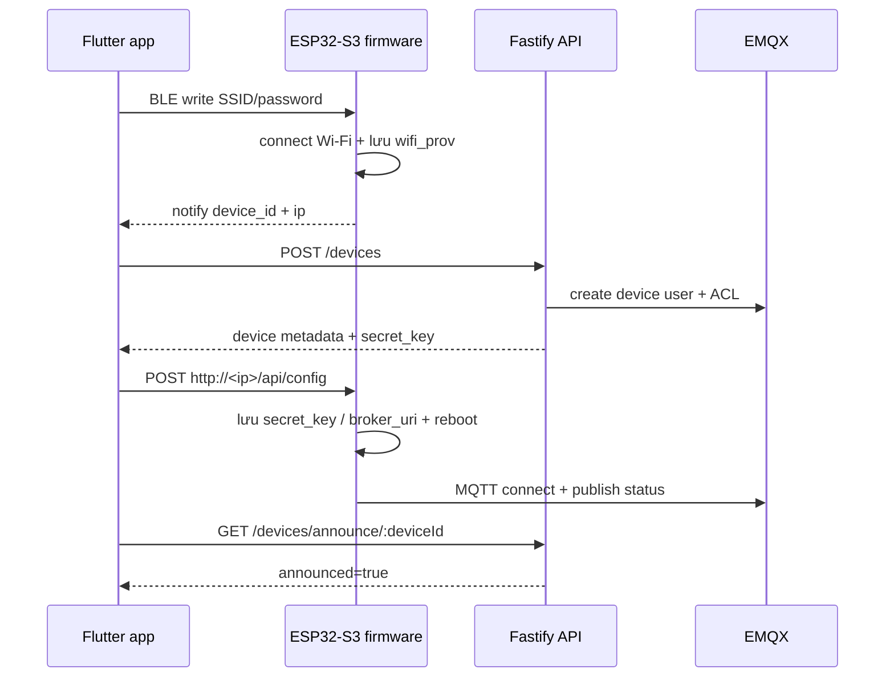
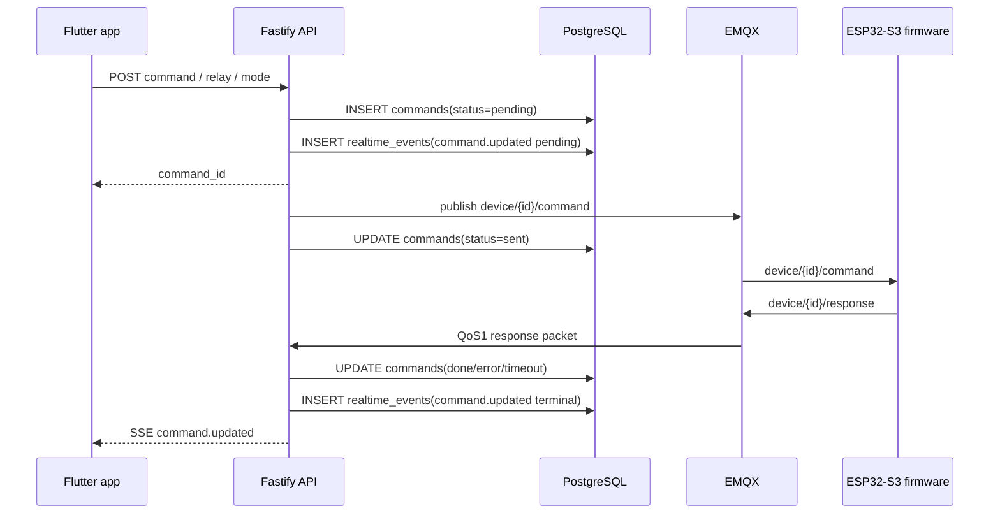

# Kiến trúc `smart-air`

Tài liệu này mô tả kiến trúc hiện đang được triển khai trong worktree của repository `smart-air`.
Mục tiêu của file là ghi lại boundary, runtime topology, luồng dữ liệu, và contract kiến trúc giữa firmware, server, app, và các dịch vụ hạ tầng.

Nguyên tắc dùng cho tài liệu này:

- Ưu tiên code, cấu hình Compose, route/plugin đang đăng ký, và wiring runtime hiện tại làm source of truth.
- Chỉ mô tả current architecture.
- Không ghi roadmap, ideal architecture, hay đề xuất tương lai trong file này.

## 1. Tổng quan hệ thống

`smart-air` là một hệ IoT gồm ba runtime boundary chính:

1. Device runtime trên ESP32-S3 chạy ESP-IDF.
2. Server/runtime stack chạy trong Docker Compose.
3. Mobile app Flutter làm control plane cho người dùng.

Ở mức tổng quan:

```text
ESP32-S3 firmware
  -> publish status / telemetry / shadow / command response / OTA progress qua MQTT
  -> subscribe command / shadow sync / OTA update qua MQTT

EMQX
  -> broker cho traffic thiết bị

Fastify API
  -> auth người dùng
  -> home / room / device access control
  -> đăng ký thiết bị
  -> MQTT bridge
  -> persistence cho command / shadow / telemetry / realtime / notification projection
  -> SSE app-facing

PostgreSQL / TimescaleDB
  -> source of truth cho dữ liệu bền vững

Redis
  -> cache và transient coordination

Flutter app
  -> dùng REST cho snapshot, mutation, history, provisioning
  -> dùng SSE cho live updates
```



App hiện tại không kết nối trực tiếp tới MQTT broker.
Public MQTT endpoint tồn tại để phục vụ device path, nhưng app runtime path hiện tại là `REST + API-owned SSE`.

Luồng dữ liệu chính từ thiết bị tới UI:

```text
+------------------------ Device ------------------------+
| sensor_task / relay / device_mode / ota               |
|        |                                               |
|        v                                               |
| MQTT client on ESP32-S3                                |
+-----------------------------+--------------------------+
                              |
                              | MQTT
                              v
+------------------------ Server stack ------------------+
| EMQX                                                   |
|   -> Fastify MQTT bridge                               |
|      -> PostgreSQL / TimescaleDB                       |
|      -> Redis                                          |
|      -> realtime_events + notification_events          |
|      -> pg_notify / SSE fanout                         |
+-----------------------------+--------------------------+
                              |
                              | HTTPS + SSE
                              v
+------------------------- Flutter app ------------------+
| Dio REST client + Dio SSE client                       |
|   -> Riverpod providers                                |
|   -> screens / dashboard / notifications / settings    |
+--------------------------------------------------------+
```

## 2. Runtime topology

### 2.1 Public ingress

Public ingress hiện tại đi theo đường:

```text
Internet
  -> Cloudflare Tunnel
  -> Nginx
  -> /api, /api/realtime, /mqtt, /ota
```

Các public path chính:

- `/api/*` -> Fastify API
- `/api/realtime` -> SSE stream từ Fastify
- `/mqtt` -> MQTT over WebSocket proxy vào EMQX `8083`
- `/ota/` -> firmware artifact từ `server/ota-files`

Expose host trực tiếp hiện bị giới hạn:

- `127.0.0.1:18083` -> EMQX dashboard
- `127.0.0.1:5050` -> pgAdmin profile `admin`
- `127.0.0.1:9000` -> Portainer profile `admin`
- `${MQTT_LAN_BIND_IP:-0.0.0.0}:8883` -> direct MQTT/TLS path tùy cấu hình LAN

Đường công khai mặc định cho thiết bị là `wss://minhnhat05.xyz/mqtt` qua Cloudflare Tunnel và Nginx, không phải raw public EMQX port.

### 2.2 Docker Compose services

`server/docker-compose.yml` hiện khai báo các service lõi:

- `nginx`: reverse proxy và OTA file host
- `emqx`: MQTT broker
- `api`: Fastify application
- `postgres`: TimescaleDB / PostgreSQL
- `redis`: cache và transient coordination
- `cloudflared`: public ingress tunnel

Service tùy chọn theo profile `admin`:

- `pgadmin`
- `portainer`

Các service lõi cùng chạy trên Docker bridge network `sa-net`.

## 3. Kiến trúc firmware

### 3.1 Vai trò của firmware

Firmware trên ESP32-S3 chịu trách nhiệm cho:

- Wi-Fi provisioning qua BLE
- local HTTP credential handoff sau khi thiết bị vào được mạng
- kết nối Wi-Fi và seed/sync thời gian
- kết nối MQTT và xử lý command
- polling sensor và publish telemetry
- quản lý mode thiết bị và relay
- OTA download, verify, và commit
- factory reset
- lưu cấu hình bền vững bằng NVS

Entrypoint của firmware vẫn là `app_main()` trong `firmware/main/main.c`, và toàn bộ boot orchestration nằm trong `firmware/components/core/sysload/sysload.c`.

### 3.2 Boot flow hiện tại

Thứ tự boot đang được triển khai trong `sysload_init()` là:

1. `led_init()` và đặt LED sang trạng thái boot.
2. Khởi tạo factory-reset button sớm.
3. Khởi tạo NVS.
4. Khởi tạo network stack và event loop.
5. Khởi tạo I2C bus nếu có peripheral I2C được bật.
6. Khởi tạo SHT3x nếu được enable.
7. Khởi tạo DS3231 nếu được enable.
8. Khởi tạo ADC bus và gas sensor nếu được enable.
9. Khởi tạo Wi-Fi station, nhưng chưa connect.
10. Nếu thiết bị chưa provision Wi-Fi thì chạy BLE provisioning.
11. Nạp SSID/password đã lưu và connect Wi-Fi.
12. Resolve `device_id`, `broker_uri`, và `secret_key` runtime từ config/NVS.
13. Start local HTTP API bằng `httpd_server_start()`.
14. Seed system clock rồi chạy one-shot SNTP sync tốt nhất có thể.
15. Nếu chưa có `secret_key`, dừng tại đây và chờ local `POST /api/config`.
16. Bootstrap runtime control: buzzer, relay, device mode, command handler đăng ký trong `sysload`.
17. Đăng ký time-sync callback và shadow-sync callback trước khi start MQTT.
18. Start MQTT client.
19. Start OTA task.
20. Start sensor task nếu có nguồn dữ liệu hợp lệ hoặc đang ở demo mode.
21. Gọi `ota_validate_and_commit()` sau khi các subsystem chính đã chạy.

Điểm đáng chú ý của boot flow hiện tại:

- Thiết bị có thể vào Wi-Fi trước khi có MQTT credential riêng.
- Local HTTP API được bật trước bước kiểm tra `secret_key`, nên provisioning cloud có thể hoàn tất ngay sau khi thiết bị đã vào LAN.
- SNTP sync diễn ra sau khi HTTP provisioning API đã được mở, không phải trước bước resolve runtime config.
- Callback cho `set_time` và `shadow/get_response` được đăng ký trước `mqtt_start()` để tránh race ngay lúc reconnect.

### 3.3 Topology phần cứng và bus

Những giả định phần cứng đang được encode trực tiếp vào code/config:

- MCU trung tâm là `ESP32-S3`.
- `SHT3x` dùng I2C địa chỉ `0x44`.
- `DS3231` dùng I2C địa chỉ `0x68`.
- Display `ILI9225` nằm trên `SPI2_HOST` khi được bật.
- SD card nằm trên `SPI3_HOST` khi được bật.
- Cảm biến khí `CO` và `NO2` dùng `ADC1`.
- Relay có ba kênh `relay_1`, `relay_2`, `relay_3`.
- LED trạng thái và factory-reset button là peripheral GPIO riêng.

Ràng buộc kiến trúc đang có trong tree:

- I2C bus được mô tả là bus dùng chung cho SHT3x và DS3231, chạy `400 kHz`.
- Display và SD card không dùng chung cùng SPI host.
- Gas sensor chỉ dùng `ADC1`, vì `ADC2` không an toàn khi Wi-Fi hoạt động.
- Layer I2C dùng API mới của ESP-IDF (`i2c_master_*`), không dùng legacy I2C API.
- `SA_DEMO_NO_PERIPHERALS` chỉ tắt một số peripheral; relay, LED, và factory reset vẫn còn hoạt động.

### 3.4 Cấu hình và persistent state

Runtime config của firmware được chia làm hai lớp:

- Kconfig defaults / compile-time flags
- NVS state / runtime override

Các nhóm state chính đang được lưu trong NVS:

- Wi-Fi provisioning data
- `secret_key` MQTT của device
- optional `broker_uri` override
- gas calibration baselines
- persisted device mode
- persisted relay states

`device_id` không phải state mutable. Nó được resolve từ Wi-Fi STA MAC và chuẩn hóa về lowercase MAC-style `aa:bb:cc:dd:ee:ff`.

### 3.5 Provisioning architecture

Provisioning hiện tại được tách làm hai bước vì Wi-Fi credential và MQTT credential đến từ hai trust boundary khác nhau.

```text
App
  -> BLE: gửi SSID/password cho device
  -> API: đăng ký device và nhận secret_key
  -> local HTTP: gửi secret_key vào device

Device
  -> dùng BLE để nhận Wi-Fi credential
  -> vào Wi-Fi
  -> mở /api/info và /api/config trên LAN
  -> lưu MQTT credential rồi reboot

Server
  -> tạo device row
  -> tạo EMQX user + ACL
  -> trả one-time secret_key cho app
```



#### Bước 1: BLE Wi-Fi provisioning

`firmware/components/general/ble_prov/ble_prov.c` triển khai BLE provisioning.

Kiến trúc hiện tại:

- Device advertise với prefix `SMART_AIR_`.
- BLE service dùng custom GATT UUID do app và firmware cùng biết.
- App gửi SSID/password qua characteristic ghi.
- Firmware thử connect Wi-Fi, lưu credential vào NVS, rồi notify lại `device_id` và IP.

BLE provisioning chỉ giải quyết Wi-Fi onboarding.
Nó không cấp MQTT credential.

#### Bước 2: local HTTP credential handoff

Sau khi thiết bị đã lên Wi-Fi, `firmware/components/general/httpd/httpd.c` mở local HTTP server với hai endpoint:

- `GET /api/info` -> trả `device_id`, `firmware`, `ip`
- `POST /api/config` -> nhận `device_id`, `secret_key`, optional `broker_uri`

`POST /api/config` hiện:

- từ chối overwrite nếu `secret_key` đã tồn tại
- buộc `device_id` gửi lên phải khớp MAC thật của thiết bị
- lưu config vào NVS
- reboot sau khi thành công

Về mặt kiến trúc, đây là bước app chuyển MQTT credential do server cấp vào firmware qua local LAN hop.

### 3.6 MQTT architecture trên thiết bị

`firmware/components/general/sa_mqtt/mqtt.c` là MQTT client của thiết bị.

Runtime shape hiện tại:

- `username = device_id`
- `client_id = device_id`
- `password = secret_key`
- broker URI đi từ config/NVS, mặc định là public WSS endpoint
- bật certificate-bundle verification
- cấu hình retained LWT offline trên topic status
- publish retained online status sau khi subscribe xong
- publish `shadow/get` ngay sau connect bootstrap

Topic thiết bị subscribe:

- `device/{id}/command`
- `device/{id}/shadow/get_response`
- `device/{id}/ota/update`

Topic thiết bị publish:

- `device/{id}/status`
- `device/{id}/telemetry`
- `device/{id}/response`
- `device/{id}/shadow/report`
- `device/{id}/shadow/get`
- `device/{id}/ota/progress`

Thiết kế hiện tại cũng đảm bảo subscription được đăng ký lại trong `MQTT_EVENT_CONNECTED`, nên reconnect không làm mất command/shadow/OTA path.

### 3.7 Mode, relay, telemetry, OTA, factory reset

Các subsystem nghiệp vụ chính của firmware hiện phân chia như sau:

- `device_mode`: giữ mode `on/off`, persist NVS, và publish shadow/telemetry transition khi mode đổi.
- `relay`: quản lý ba relay thật trên GPIO, persist state, chỉ cho đổi khi device mode đang `on`.
- `sensor_task`: publish telemetry và shadow/report theo chu kỳ `CONFIG_SA_SENSOR_POLLING_INTERVAL`.
- `ota`: nhận trigger từ `device/{id}/ota/update`, tải artifact qua HTTPS, verify SHA-256, publish progress, render local OTA full-screen trên `ILI9225` khi display được bật, reboot, rồi commit image sau boot thành công.
- `factory_reset`: xóa default NVS partition và đưa thiết bị về provisioning state; gas calibration R0 nằm trong NVS partition `calib` nên vẫn thuộc sensor vật lý sau reset.

Telemetry contract từ firmware hiện dùng các field:

- `device_id`
- `mode`
- `ts`
- `temperature`
- `humidity`
- `co_ppm`
- `no2_ppm`

Khi `SA_DEMO_NO_PERIPHERALS` được bật, firmware vẫn giữ nguyên topic và schema; chỉ đổi nguồn dữ liệu sensor sang sample demo.

## 4. Kiến trúc server

### 4.1 Vai trò của server stack

Server stack là trust boundary cho:

- user authentication
- home membership và role enforcement
- device registration
- EMQX user/ACL provisioning
- MQTT bridge ingestion
- command queueing
- shadow persistence
- telemetry persistence
- realtime fanout cho app
- notification projection cho app

Entrypoint chính của API là `server/api/src/app.js`.

### 4.2 Thành phần Fastify API

Fastify hiện register các plugin lõi:

- `db`
- `redis`
- `auth`
- `mqtt`
- `realtime`

Các route group đang được đăng ký dưới prefix `/api`:

- `health`
- `auth`
- `homes`
- `devices`
- `shadow`
- `commands`
- `telemetry`
- `notifications`
- `realtime`

Lưu ý về rooms:

- Room CRUD không phải một route group tách riêng.
- Nó hiện nằm trong `homesRoutes` với các endpoint nested `/homes/:homeId/rooms` và route trực tiếp `/rooms/:id`.

### 4.3 Persistent model

PostgreSQL / TimescaleDB là canonical source of truth cho dữ liệu bền vững.

Các bảng lõi đang tham gia vào kiến trúc runtime hiện tại gồm:

- `users`
- `refresh_tokens`
- `homes`
- `home_members`
- `rooms`
- `devices`
- `device_shadows`
- `commands`
- `telemetry`
- `realtime_events`
- `notification_events`

Vai trò chính:

- `devices`: inventory, ownership, online metadata, firmware version, secret hash
- `device_shadows`: `reported` và `desired`
- `commands`: hàng đợi command và terminal status
- `telemetry`: time-series sensor data
- `realtime_events`: durable SSE replay log
- `notification_events`: projection để app lấy danh sách notification

### 4.4 Redis role

Redis trong kiến trúc hiện tại là cache và transient coordination layer, không phải nguồn sự thật cuối cùng.

Các key/runtime role nổi bật:

- `shadow:{deviceId}` cho shadow cache
- `announce:{deviceId}` cho provisioning announce poll
- `ota_progress:{deviceId}` cho OTA progress cache

Write path quan trọng vẫn đi theo hướng DB-first, cache-second.

### 4.5 Auth và session model

Auth phía app/server hiện đi theo mô hình JWT access token + refresh token.

Fastify API:

- nhận access token qua `Authorization: Bearer <token>`
- ký JWT cho app client
- quản lý refresh token trong DB
- expose `login`, `register`, `refresh`, `logout`

Refresh token được dùng cho cả browser-style cookie path và mobile-style body field, nhưng app Flutter hiện dùng body field và secure storage của chính nó.

### 4.6 EMQX và MQTT bridge

EMQX là broker cho device traffic.

Server đảm nhiệm hai identity domain ở broker:

- Device identity:
  - `username = device_id`
  - `password = secret_key`
- Bridge identity:
  - mặc định `username = sa-server`
  - password lấy từ `EMQX_MQTT_PASSWORD`

`server/api/src/services/emqx.js` chịu trách nhiệm provision EMQX user và ACL.

`server/api/src/plugins/mqtt.js` là internal MQTT bridge của API.
Bridge hiện:

- connect vào `mqtt://emqx:1883` trong Docker network
- subscribe QoS 1 vào:
  - `device/+/status`
  - `device/+/telemetry`
  - `device/+/response`
  - `device/+/shadow/report`
  - `device/+/shadow/get`
  - `device/+/ota/progress`
- publish command/shadow response qua broker
- dùng manual ack để handler lỗi thì message có thể được redeliver

### 4.7 Device registration path

`POST /api/devices` là transaction đăng ký thiết bị.

Luồng kiến trúc hiện tại:

1. API kiểm tra access vào home/room.
2. Tạo `secret_key`.
3. Provision EMQX user + ACL cho thiết bị.
4. Insert row vào `devices`.
5. Trả metadata thiết bị cùng one-time `secret_key` cho app.

App sau đó chịu trách nhiệm đưa `secret_key` này vào firmware qua local `POST /api/config`.

### 4.8 Command architecture

Command là app-originated nhưng device-executed.

Luồng hiện tại:

```text
App REST request
  -> API validate auth + access
  -> INSERT commands(status='pending')
  -> create realtime event command.updated(pending)
  -> flush pending queue nếu MQTT bridge đang ready
  -> publish device/{id}/command
  -> mark sent
  -> firmware execute
  -> firmware publish device/{id}/response
  -> API cập nhật done / error / timeout
  -> create realtime event command.updated(terminal)
```



Tính chất kiến trúc của command path:

- DB là hàng đợi canonical, không phải fire-and-forget MQTT.
- `flushPending()` serialize publish theo từng device bằng advisory lock.
- Nếu pending quá hạn thì command chuyển sang `timeout`.
- Các typed endpoint như relay/mode chỉ là API façade phía trên cùng DB-backed command path.

### 4.9 Shadow architecture

Shadow hiện chia làm hai nửa:

- `reported`: trạng thái firmware báo lên
- `desired`: trạng thái server/app muốn device hội tụ về

Luồng hiện tại:

- firmware publish `shadow/report`
- API validate và UPSERT `reported`
- app ghi `desired` qua REST
- firmware publish `shadow/get` để xin state mong muốn
- API trả `shadow/get_response` với `desired` và `delta`

Shadow là cơ chế đồng bộ trạng thái bền vững.
Nó không thay thế command path cho các tác vụ điều khiển tức thời.

### 4.10 Realtime và notification projection

Realtime app-facing hiện do API sở hữu, dùng SSE thay vì app MQTT.

`server/api/src/services/realtime-events.js` tạo durable event trong `realtime_events`.
Các event type hiện được tạo từ ingestion/runtime path gồm:

- `device.status`
- `telemetry.point`
- `shadow.reported`
- `command.updated`
- `ota.progress`

`server/api/src/plugins/realtime.js`:

- mở `GET /api/realtime`
- yêu cầu JWT auth như API bình thường
- hỗ trợ `Last-Event-ID`
- phát heartbeat comment frame
- replay event từ `realtime_events`
- phát `replay.reset` nếu replay gap không phục vụ được
- kiểm tra access trước khi gửi từng event cho client

Song song với realtime, server còn có notification projection:

- `createRealtimeEvent(...)` gọi `projectNotificationEvent(...)`
- các event phù hợp được project vào `notification_events`
- `GET /api/notifications` trả danh sách notification đã project cho user hiện tại

Trong worktree hiện tại, notification projection đang lấy từ:

- `device.status`
- terminal `command.updated`
- terminal `ota.progress`

## 5. Kiến trúc app

### 5.1 Vai trò của app

App Flutter là control plane cho người dùng cuối.

Hiện tại app phụ trách:

- auth và session restore
- home và room management
- device provisioning
- device dashboard
- command issuance
- telemetry history và live status
- notification list
- profile và một số màn hình settings theo thiết bị

### 5.2 Navigation và screen topology

`app/lib/core/router.dart` định nghĩa routing hiện tại.

Shell chính dùng `StatefulShellRoute.indexedStack` với ba tab:

- `/home`
- `/notifications`
- `/profile`

Các drill-down route đáng chú ý:

- `/homes`
- `/homes/create`
- `/homes/:homeId`
- `/provision`, `/provision/scan`, `/provision/wifi`, `/provision/announce`, `/provision/name`
- `/devices/:id`
- `/devices/:id/commands`
- `/devices/:id/settings`
- `/devices/:id/calibrate/:sensor`
- `/devices/:id/ota`

### 5.3 Auth và session model trên app

`app/lib/providers/auth_provider.dart` đang giữ auth session state.

Thiết kế hiện tại:

- access token chỉ giữ trong memory
- refresh token và serialized user được lưu trong secure storage
- `dioProvider` gắn `AuthInterceptor` để tự refresh access token khi cần
- `GoRouter` redirect theo auth state
- logout sẽ clear secure storage, access token trong memory, và invalidate các session-scoped provider

### 5.4 Service boundary của app

App hiện có ba nhóm transport rõ ràng:

- REST qua `Dio` tới `https://minhnhat05.xyz/api`
- SSE qua `GET /realtime`
- BLE + local HTTP cho provisioning

`app/lib/core/app_config.dart` vẫn giữ `defaultMqttBrokerUri = wss://minhnhat05.xyz/mqtt`, nhưng app không dùng URI này để mở MQTT client của riêng mình.
Giá trị đó hiện thuộc provisioning/config context, không phải live app transport.

### 5.5 Provisioning flow trong app

Provisioning flow của app là flow đa transport:

1. App scan và kết nối BLE tới device.
2. App gửi SSID/password qua BLE.
3. Device trả lại `device_id` và IP sau khi đã vào Wi-Fi.
4. App gọi `POST /devices` để đăng ký thiết bị trên backend.
5. API trả `secret_key`.
6. App gọi local `POST http://<device-ip>/api/config`.
7. Device reboot và lên MQTT.
8. App poll `/devices/announce/:mac` để xác nhận thiết bị đã online.

`app/lib/services/device_service.dart` hiện là lớp service chịu trách nhiệm chính cho flow này.

### 5.6 Riverpod state model

State app hiện tổ chức quanh Riverpod providers/notifiers.

Những provider nổi bật:

- `authProvider`
- `homesProvider`
- `roomsProvider(homeId)`
- `devicesProvider`
- `shadowProvider(deviceId)`
- `commandsProvider(deviceId)`
- `telemetryLiveProvider(deviceId)`
- `telemetryHistoryProvider(...)`
- `notificationsProvider`
- `realtimeEventsProvider`

Pattern hiện tại là:

- REST fetch snapshot ban đầu
- `realtimeEventsProvider` cung cấp stream event dùng chung
- domain-specific notifier nghe stream này rồi apply đúng event type của mình

Ví dụ:

- `devicesProvider` phản ứng với `device.status`
- `shadowProvider` phản ứng với `shadow.reported`
- `commandsProvider` phản ứng với `command.updated`
- `telemetryLiveProvider` phản ứng với `telemetry.point` và `replay.reset`
- `notificationsProvider` vừa fetch `GET /notifications`, vừa bổ sung item mới từ realtime stream

### 5.7 Realtime client của app

`app/lib/services/realtime_service.dart` triển khai SSE client hiện tại.

Đặc tính chính:

- dùng `Dio` với `Accept: text/event-stream`
- giữ `Last-Event-ID` trong session memory của stream
- reconnect theo exponential backoff
- trạng thái kết nối gồm:
  - `disconnected`
  - `connecting`
  - `connected`
  - `degraded`
- đánh dấu `degraded` khi server gửi `replay.reset`

Luồng realtime hiện tại là:

```text
API SSE stream
  -> SseDecoder
  -> RealtimeEvent model
  -> Riverpod listener trong các notifier
  -> chỉ domain state liên quan được cập nhật
  -> UI cập nhật theo slice tương ứng
```

## 6. Hợp đồng cross-stack

### 6.1 Identity chung

`device_id` là identity chung giữa các layer:

- derive từ MAC ở firmware
- dùng làm username/client ID ở MQTT device side
- dùng trong topic `device/{deviceId}/...`
- dùng làm khóa chính của thiết bị ở API và database
- dùng trong model và route của app

Format chuẩn hiện tại là lowercase MAC-style `aa:bb:cc:dd:ee:ff`.

### 6.2 Phân vai transport

Phân lớp transport hiện tại của hệ thống:

- MQTT:
  - device <-> broker
  - status, telemetry, command, response, shadow sync, OTA
- REST:
  - app <-> API
  - auth, CRUD, provisioning registration, shadow desired, command submit, telemetry history, notifications snapshot
- SSE:
  - API <-> app
  - device status, telemetry.point, shadow.reported, command.updated, ota.progress, replay.reset

### 6.3 Ba luồng xuyên stack quan trọng

#### Provisioning

```text
App BLE
  -> Device Wi-Fi connect
  -> App POST /devices
  -> API trả secret_key
  -> App POST http://device/api/config
  -> Device reboot
  -> Device MQTT online
  -> App poll announce
```

#### Telemetry

```text
sensor_task
  -> device/{id}/telemetry
  -> EMQX
  -> API MQTT handler
  -> INSERT telemetry + create realtime_events row
  -> SSE
  -> telemetryLiveProvider / dashboard
```

#### Command

```text
App action
  -> REST command endpoint
  -> DB-backed command queue
  -> MQTT publish to device
  -> firmware execute
  -> device/{id}/response
  -> API cập nhật command status
  -> realtime event + notification projection khi phù hợp
```

## 7. Source-of-truth liên quan

Các file contract liên quan trực tiếp tới kiến trúc hiện tại:

- `docs/MQTT_PROTOCOL.md`: contract topic/payload MQTT
- `docs/API_REFERENCE.md`: HTTP contract của API
- `server/docker-compose.yml`: runtime topology của server stack
- `firmware/components/core/sysload/sysload.c`: boot orchestration của firmware
- `server/api/src/app.js`: plugin và route registration của API
- `app/lib/core/router.dart`: routing topology của app

Khi tài liệu này xung đột với các file trên hoặc với code runtime hiện tại, code và wiring hiện tại phải được xem là chuẩn cao hơn.
