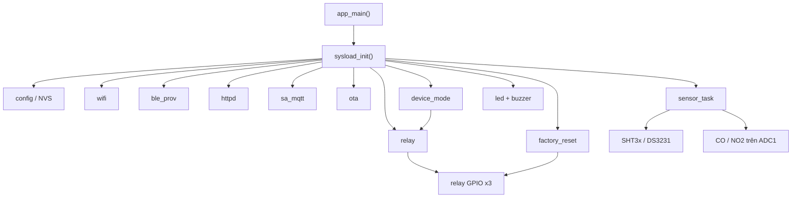
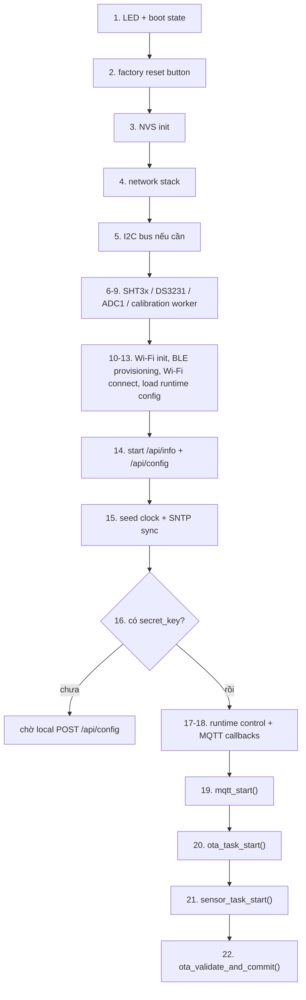
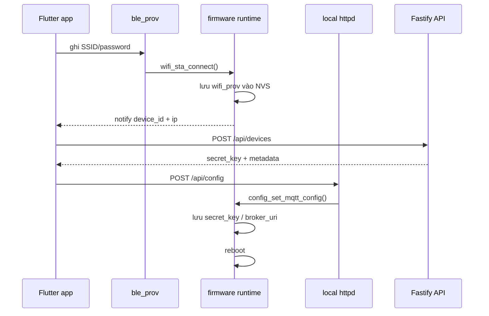
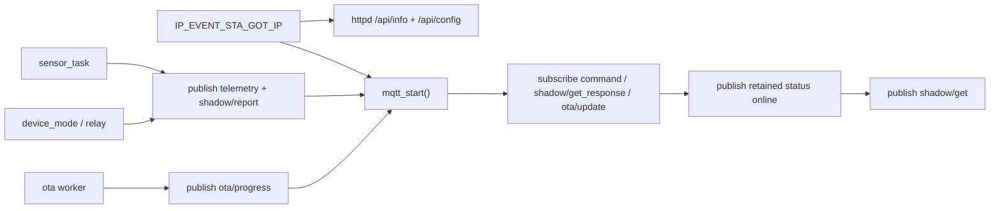

# ARCHITECTURE_FIRMWARE.md

Tài liệu này mô tả kiến trúc firmware hiện đang implemented trong `smart-air` tại thời điểm hiện tại của repo. Nội dung chỉ bám vào firmware runtime, config, và các ràng buộc đã thấy trong code; không mô tả target architecture hay roadmap.

## 1. Vai trò của firmware

Firmware chạy trên ESP32-S3 và là runtime phía thiết bị cho các trách nhiệm sau:

- bootstrap phần cứng và runtime services
- BLE provisioning cho Wi-Fi
- local HTTP handoff để nhận MQTT credential lần đầu
- kết nối Wi-Fi, seed thời gian hệ thống, và best-effort SNTP sync
- MQTT client cho status, telemetry, shadow, command, và OTA
- polling sensor, publish telemetry, và đồng bộ shadow reported
- quản lý `device mode`, relay, buzzer, LED trạng thái
- factory reset vật lý
- HTTPS OTA với rollback-aware validation

Entrypoint vẫn là `app_main()` trong `firmware/main/main.c`, và phần orchestration chính nằm ở `firmware/components/core/sysload/sysload.c`.

## 2. Ranh giới component

Firmware hiện được tổ chức thành các nhóm component chính:

| Nhóm | Vai trò hiện tại | Ví dụ |
| --- | --- | --- |
| `config/` | constants dùng toàn firmware, mapping Kconfig, API đọc/ghi NVS | `config.h`, `config.c` |
| `core/` | orchestration boot, sensor task, device mode | `sysload`, `sensor_task`, `device_mode` |
| `general/` | runtime services chung và peripheral-facing helpers | `wifi`, `ble_prov`, `httpd`, `sa_mqtt`, `relay`, `factory_reset`, `led`, `buzzer` |
| `drivers/` | abstraction cho bus và device-level drivers | `i2c_bus`, `adc_bus`, `sht3x`, `ds3231`, `gm702b`, `gm102b`, `ili9225`, `sd_card` |
| `ota/` | OTA queue/task và post-boot validation | `ota.c`, `ota.h` |

Ở trạng thái repo hiện tại, orchestration runtime thực sự đang dùng mạnh `wifi`, `ble_prov`, `httpd`, `sa_mqtt`, `sensor_task`, `device_mode`, `relay`, `factory_reset`, `ota`, cùng các sensor drivers I2C/ADC. Driver tree cho `ILI9225` và `SD card` đã có mặt trong cấu trúc source + Kconfig, nhưng `sysload_init()` hiện chưa wire display/SD vào boot path đang chạy.



## 3. Kiến trúc runtime tổng quát

```text
+--------------------------- ESP32-S3 ---------------------------+
| app_main -> sysload_init                                       |
|                                                                |
|   config/NVS <---------------------------------------------+   |
|   wifi ----------------------------------------------------+|   |
|   ble_prov (Wi-Fi only)                                    ||   |
|   httpd (/api/info, /api/config)                           ||   |
|   sa_mqtt (status/command/shadow/ota topics)               ||   |
|   ota task                                                 ||   |
|   sensor_task ---------------------------------------------+|   |
|   device_mode + relay + buzzer + LED                        |   |
|   factory_reset                                             |   |
+-------------------------------+-------------------------------+
                                |
         +----------------------+----------------------+
         |                      |                      |
         v                      v                      v
     I2C bus                ADC1 inputs          GPIO / runtime control
     - SHT3x                - CO sensor          - relay x3
     - DS3231               - NO2 sensor         - WS2812 LED
                                                  - reset button

     SPI topology defined in build config:
     - SPI2_HOST -> ILI9225 display
     - SPI3_HOST -> SD card
```

## 4. Boot và orchestration

`sysload_init()` là boot orchestrator hiện tại. Trình tự đang được code thực thi là:

1. init LED để trạng thái boot hiện ra ngay lập tức
2. init factory-reset button từ sớm để nút reset hoạt động ở mọi phase boot
3. init NVS
4. init network stack
5. init I2C bus nếu có ít nhất một I2C device được bật
6. init `SHT3x` nếu bật
7. init `DS3231` nếu bật
8. init `ADC1` bus và gas sensors nếu bật; load R0 calibration đã lưu trong NVS partition `calib` và register command handlers `calibrate_co` / `calibrate_no2`
9. start calibration worker nếu có gas sensor cần worker
10. init Wi-Fi station
11. nếu chưa provisioning Wi-Fi thì chạy BLE provisioning flow
12. load Wi-Fi credentials từ NVS và kết nối Wi-Fi nếu chưa kết nối sẵn qua BLE flow
13. resolve immutable `device_id`, load `broker_uri`, `secret_key`
14. start local HTTP server trước MQTT login đầu tiên
15. seed system clock rồi thử SNTP sync best-effort
16. nếu chưa có `secret_key` thì dừng tại đây và chờ `POST /api/config`
17. init buzzer, relay, device mode, rồi register runtime command handlers
18. register time-sync callback và shadow-sync callback cho MQTT
19. start MQTT client
20. start OTA task
21. start sensor task nếu có sensor runtime hợp lệ, hoặc start demo sensor task khi `SA_DEMO_NO_PERIPHERALS=y`
22. sau cùng gọi `ota_validate_and_commit()` để commit image OTA vừa boot nếu image đang ở trạng thái pending verify

Một vài ràng buộc kiến trúc đang encode trực tiếp trong boot flow:

- local HTTP provisioning phải có trước lần MQTT login đầu tiên
- MQTT callbacks cho `set_time` và `shadow/get_response` phải được register trước `mqtt_start()` để tránh race khi broker push dữ liệu ngay sau connect
- sensor task chỉ start khi có device ID hợp lệ và ít nhất một source dữ liệu runtime hợp lệ, trừ demo mode
- OTA image chỉ được mark valid sau khi các subsystem chính đã lên thành công



## 5. Topology phần cứng và bus

### 5.1 I2C

- shared I2C bus dùng cho `SHT3x` và `DS3231`
- `SHT3x` đang được fixed ở địa chỉ `0x44`
- `DS3231` đang được fixed ở địa chỉ `0x68`
- `SA_I2C_FREQ_HZ` bị khóa ở `400000`, tức 400 kHz

### 5.2 Analog sensors

- `CO` và `NO2` dùng `ADC1`
- Kconfig ép cả hai pin phải nằm trong dải GPIO `1..10`
- `NO2` phải khác pin `CO`
- channel mapping trong code được derive theo quy tắc `ADC1 channel = GPIO - 1`

### 5.3 SPI topology

Kconfig hiện encode topology SPI như sau:

- `SPI2_HOST` dành cho `ILI9225`
- `SPI3_HOST` dành cho `SD card`

Trong tree hiện tại, đây là ràng buộc build/config và driver layout. Boot path đang chạy chưa gọi init cho display hoặc SD card, nên ở trạng thái implemented hiện tại hai phần này là reserved hardware topology hơn là active runtime path.

### 5.4 GPIO-backed runtime control

- 3 relay channels dùng GPIO riêng
- WS2812 RGB LED dùng GPIO riêng
- factory reset button dùng GPIO riêng, active-low, pull-up nội bộ
- relay, LED, và factory reset vẫn là các runtime control path độc lập với nhóm peripheral bị tắt trong demo mode

## 6. Compile-time config và persistent state

Firmware chia config thành hai lớp:

- compile-time defaults trong `firmware/main/Kconfig.projbuild`
- runtime overrides / persisted state trong NVS

### 6.1 Compile-time config

Những nhóm config quan trọng hiện tại:

- provisioning: `SA_PROV_NAME_PREFIX`, `SA_PROV_TIMEOUT_MS`
- network: `SA_MQTT_BROKER_URI`, `SA_CUSTOM_DNS_SERVER`, `SA_WIFI_CONNECT_TIMEOUT_MS`
- time sync: `SA_SNTP_SERVER`, `SA_SNTP_SYNC_TIMEOUT_MS`
- local API: `SA_HTTPD_PORT`
- telemetry cadence: `SA_SENSOR_POLLING_INTERVAL`
- feature gates: `SA_ENABLE_*`
- bus/pin topology cho I2C, SPI2, SPI3, ADC1, relay, buzzer, LED, factory reset

### 6.2 Demo mode

`SA_DEMO_NO_PERIPHERALS` là một compile-time switch đặc biệt:

- nó force-disable `SHT3x`, `DS3231`, `CO`, `NO2`, `ILI9225`, `SD card`, `buzzer`
- nó không disable `relay`, `LED`, hay `factory reset`
- sensor task trong mode này phát dữ liệu mẫu quay vòng nhưng vẫn giữ nguyên topic và JSON schema

Kiến trúc ở đây là: demo mode thay nguồn dữ liệu phần cứng bằng sample data, không thay transport contract.

### 6.3 NVS responsibilities

NVS hiện đang giữ các nhóm state sau:

- namespace `wifi_prov`: `ssid`, `password`, cờ `done`
- namespace `device`: `secret_key`, optional `broker_uri`
- namespace `device`: persisted `mode`
- namespace `device`: persisted `relay_1`, `relay_2`, `relay_3`
- partition `calib`, namespace `gas_calib`: calibration baselines cho gas sensors (`r0_co`, `r0_no2`)

`device_id` không phải mutable config trong trạng thái hiện tại. Nó luôn được derive từ Wi-Fi STA MAC, normalize về lowercase MAC format `aa:bb:cc:dd:ee:ff`.

### 6.4 NVS write coordination

`config_nvs_write_begin()` / `config_nvs_write_end()` là shared guard giữa các writer bình thường và factory reset flow. Mục tiêu là chặn NVS writes mới khi factory reset đang erase default NVS partition.

### 6.5 Broker URI contract

`config_set_mqtt_config()` chỉ chấp nhận:

- `device_id` đúng MAC thật của thiết bị
- `secret_key` không rỗng
- `broker_uri` có scheme `wss://` hoặc `mqtts://` khi có override

Nếu không có `broker_uri` trong NVS thì firmware fallback về Kconfig default.

## 7. Provisioning architecture

Provisioning hiện được tách làm hai bước với hai trust boundary khác nhau:

1. BLE provisioning để đưa Wi-Fi credentials vào thiết bị
2. local HTTP handoff để đưa MQTT credentials vào thiết bị sau khi app đã đăng ký device với server



### 7.1 BLE Wi-Fi provisioning

`firmware/components/general/ble_prov/ble_prov.c` hiện triển khai một custom GATT service:

- service UUID `0xFFFE`
- characteristic `0xFF01`: ghi SSID
- characteristic `0xFF02`: ghi password
- characteristic `0xFF03`: notify status

Tên quảng bá BLE có dạng:

`<SA_PROV_NAME_PREFIX>_<last-3-byte-Wi-Fi-STA-MAC-hex>`

Repo default hiện tại cho prefix là `SMART_AIR`.

Luồng hiện tại:

1. app ghi SSID/password vào GATT characteristics
2. provisioning task gọi `wifi_sta_connect(...)`
3. nếu thành công, firmware lưu `ssid/password` vào NVS `wifi_prov`
4. khi thành công, firmware notify JSON status về app với `ip`, `device_id`, và `status="ok"`

Kiến trúc security hiện tại của bước BLE này là tối giản: code path hiện không bật cơ chế pairing/bonding bắt buộc trước khi ghi credentials, nên provisioning BLE được thiết kế như một bootstrap flow trên thiết bị mới chưa có trust material.

### 7.2 Local HTTP MQTT credential handoff

Sau khi Wi-Fi đã có IP, firmware start local HTTP server với hai endpoint:

- `GET /api/info` trả `device_id`, `firmware`, `ip`
- `POST /api/config` nhận `device_id`, `secret_key`, và optional `broker_uri`

`POST /api/config` chỉ chấp nhận lần set MQTT credential đầu tiên:

- body phải có `device_id` và `secret_key`
- nếu `secret_key` đã tồn tại trong NVS thì trả conflict
- `device_id` gửi lên phải đúng MAC thật của thiết bị
- nếu lưu config thành công thì firmware tạo task reboot

Ở trạng thái implementation hiện tại, đây là plain HTTP local-LAN bootstrap, không có request auth hay bootstrap token riêng trong firmware.

## 8. Network và MQTT architecture

### 8.1 Wi-Fi side

Firmware chỉ coi Wi-Fi là ready sau `IP_EVENT_STA_GOT_IP`. Tại thời điểm này:

- IP được lưu vào runtime state để phục vụ `GET /api/info`
- custom DNS từ `SA_CUSTOM_DNS_SERVER` được apply vào `WIFI_STA_DEF`
- nếu custom DNS apply fail thì firmware chỉ log warning và tiếp tục với DHCP DNS

### 8.2 MQTT identity và transport

MQTT client hiện dùng:

- `device_id` làm MQTT username
- `device_id` làm MQTT client ID
- `secret_key` làm MQTT password
- `broker_uri` lấy từ NVS override hoặc Kconfig default

Transport side dùng `esp_crt_bundle_attach` cho TLS verification. Repo default broker URI hiện là `wss://minhnhat05.xyz/mqtt`, nhưng contract `config_set_mqtt_config()` cũng chấp nhận `mqtts://`.



### 8.3 MQTT topics

Khi `mqtt_start()` chạy, firmware build topic strings theo `device_id`:

- `device/{id}/status`
- `device/{id}/command`
- `device/{id}/response`
- `device/{id}/shadow/get`
- `device/{id}/shadow/get_response`
- `device/{id}/ota/update`
- `device/{id}/ota/progress`

### 8.4 Connect-time behavior

Trong `MQTT_EVENT_CONNECTED`, firmware:

1. subscribe lại các topic bắt buộc
2. publish retained online status `{"online":true,"firmware":"..."}`
3. publish current shadow
4. publish `shadow/get` để xin desired/latest state từ server

MQTT session cũng cấu hình retained LWT `{"online":false}` trên topic status.

### 8.5 RX handling và command dispatch

MQTT RX path có ba tính chất kiến trúc chính:

- payload/topic được copy khỏi buffer của callback trước khi xử lý
- command dispatch là registry-based qua `mqtt_register_command_handler(...)`
- command cache theo `command_id` giúp dedupe command duplicate

Các command path đang có trong firmware:

- `relay_set`
- `device_mode`
- `set_time`
- `calibrate_co`
- `calibrate_no2`

`set_config` bị reject trên MQTT; provisioning path được support là local `POST /api/config`. OTA cũng không đi qua generic command topic mà đi qua `device/{id}/ota/update`.

### 8.6 Shadow sync

Callback `handle_shadow_get_response(...)` trong `sysload.c` hiện apply state từ `delta` hoặc `desired`, với các key firmware đang xử lý trực tiếp là:

- `mode`
- `relay_1`
- `relay_2`
- `relay_3`

Nếu `mode=off` được apply trước, relay keys sẽ bị bỏ qua trong cùng patch đó.

## 9. Telemetry, device mode, relay

### 9.1 Sensor task

`sensor_task` build topic theo `device_id` và publish lên:

- `device/{id}/telemetry`
- `device/{id}/shadow/report`

Telemetry JSON hiện giữ schema ổn định với các field chính:

- `device_id`
- `mode`
- `ts`
- `temperature`
- `humidity`
- `co_ppm`
- `no2_ppm`

Nếu một sensor không khả dụng, firmware publish `null` cho field đó thay vì đổi schema.

### 9.2 Device mode

`device_mode` là state machine runtime đơn giản với persisted backing trong NVS:

- `on`: sensor task được phép publish
- `off`: sensor publish bị gate, relays bị force off

Khi chuyển sang `off`, firmware:

- publish final null telemetry với `mode="off"`
- force all relays off
- publish shadow mode-off, gồm cả `relay_1..3 = false`
- persist mode = off

Khi chuyển sang `on`, firmware:

- enable lại sensor task
- persist mode = on
- publish current shadow với trạng thái relay đang lưu

### 9.3 Relay architecture

Relay layer hiện:

- giữ state trong RAM với critical section lock
- restore persisted relay state từ NVS lúc init
- từ chối `relay_set()` khi `device_mode` đang `off`
- persist state sau mỗi thay đổi thành công
- publish shadow delta cho relay vừa đổi
- beep buzzer sau thay đổi relay thành công

`relay_force_all_off()` vừa kéo GPIO xuống thấp vừa persist lại từng relay về `false`.

## 10. Factory reset

Factory reset hiện là physical hold-to-reset flow:

- polling mỗi 50 ms
- sau 1 giây giữ nút thì LED đổi sang trạng thái cảnh báo factory reset
- khi giữ đủ `SA_FACTORY_RESET_HOLD_MS` thì chạy reset sequence

Reset sequence hiện tại:

1. acquire factory-reset guard để chặn writers khác vào NVS
2. set sensor publish gate = false
3. deinit Wi-Fi best-effort
4. stop MQTT sạch để tránh reconnect trước reboot
5. erase toàn bộ default NVS partition; NVS partition `calib` giữ gas R0 vì calibration thuộc sensor vật lý
6. reboot

Scope reset được code log rõ là: Wi-Fi provisioning, MQTT creds/URI, mode, relay state, và thực tế là toàn bộ firmware state trong default NVS partition. Gas calibration không thuộc scope reset; `r0_co` / `r0_no2` sống trong partition `calib` và chỉ bị overwrite khi người dùng chạy `calibrate_co` / `calibrate_no2` lại.

## 11. OTA architecture

OTA nằm trong component riêng với queue depth = 1 và worker task riêng.

Luồng implemented hiện tại:

1. MQTT nhận payload ở `device/{id}/ota/update`
2. payload phải có `url` và `sha256`
3. `ota_trigger()` chỉ nhận URL bắt đầu bằng `https://`
4. OTA worker download image bằng `esp_https_ota`
5. progress được publish lên `device/{id}/ota/progress` theo từng bucket 10%
6. nếu có `sha256`, firmware đọc SHA-256 của next-update partition và so khớp trước `esp_https_ota_finish()`
7. thành công thì publish `{"progress":100,"status":"rebooting"}` rồi reboot
8. ở boot tiếp theo, `ota_validate_and_commit()` mark image valid nếu image đang ở trạng thái `ESP_OTA_IMG_PENDING_VERIFY`

Kiến trúc này làm hai việc tách biệt:

- OTA trigger là async và non-blocking với phần còn lại của runtime
- post-boot validation quyết định image mới có được commit hay rollback hay không

## 12. Hard assumptions hiện có

Các giả định/ràng buộc đang encode rõ trong repo hiện tại:

- `device_id` luôn bám theo Wi-Fi STA MAC, không phải mutable device name
- firmware chỉ chấp nhận MQTT broker override theo `wss://` hoặc `mqtts://`
- Wi-Fi-dependent runtime path phải đợi `IP_EVENT_STA_GOT_IP`
- MQTT subscriptions phải được re-register trong `MQTT_EVENT_CONNECTED`
- MQTT callback không xử lý trực tiếp buffer gốc của event
- demo mode không đổi transport contract
- display và SD card đã có topology/config rõ ràng nhưng chưa nằm trong runtime boot path hiện tại
