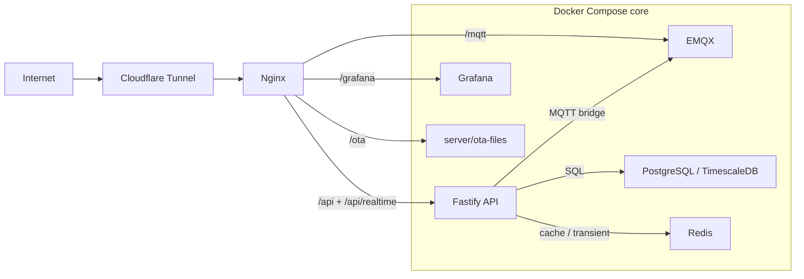
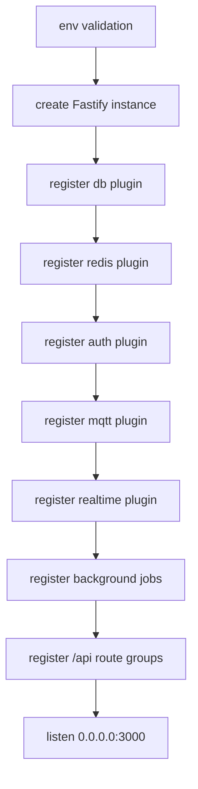
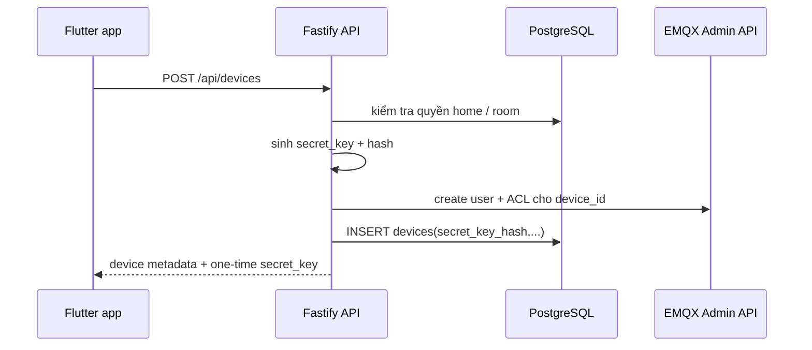
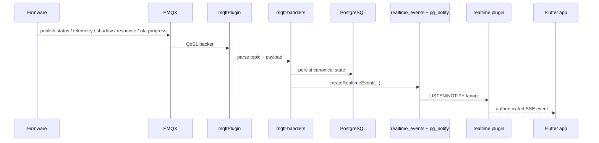

# ARCHITECTURE_SERVER.md

Tài liệu này mô tả kiến trúc server hiện đang implemented trong `smart-air` tại thời điểm hiện tại của repo. Scope chỉ bao gồm boundary `server/` và `server/api/`: hạ tầng Docker Compose, ingress, broker MQTT, API Fastify, persistence, realtime, và các background jobs. Nội dung bám vào code và config đang có, không mô tả target architecture hay runbook vận hành chi tiết.

## 1. Vai trò của server

Boundary server của `smart-air` là control plane trung tâm cho toàn hệ thống. Ở trạng thái repo hiện tại, server chịu trách nhiệm cho:

- public ingress qua Cloudflare Tunnel và Nginx
- xác thực người dùng, phân quyền theo home/device, và quản lý session
- đăng ký thiết bị và cấp broker credential theo từng `device_id`
- bridge MQTT giữa thiết bị và lớp dữ liệu ứng dụng
- canonical persistence cho user, home, device, command, shadow, telemetry, realtime event, notification event
- app-facing realtime dưới dạng authenticated SSE
- dashboards và các bề mặt operator nội bộ

Server không phải chỉ là một REST API đơn lẻ. Nó là tập hợp của nhiều runtime services có wiring cố định trong `server/docker-compose.yml`, trong đó `server/api/` là business backend còn Nginx, EMQX, PostgreSQL/TimescaleDB, Redis, Grafana, và Cloudflare Tunnel là các service hạ tầng đi kèm.

## 2. Topology tổng quát

```text
Internet
  -> Cloudflare Tunnel
  -> Nginx
       -> /api/*          -> Fastify API
       -> /api/realtime   -> Fastify SSE stream
       -> /mqtt           -> EMQX WebSocket listener
       -> /grafana/       -> Grafana
       -> /ota/           -> static OTA binaries

Fastify API
  -> PostgreSQL / TimescaleDB    (source of truth)
  -> Redis                       (cache + transient coordination)
  -> EMQX Admin API              (device/bridge auth + ACL provisioning)
  -> MQTT bridge client          (ingest device traffic, publish commands)
  -> pg_notify LISTEN/NOTIFY     (fanout realtime events)

EMQX
  <-> firmware/device MQTT traffic

Flutter app
  -> REST over /api/*
  -> SSE over /api/realtime
```



### 2.1 Docker Compose services

`server/docker-compose.yml` hiện định nghĩa các service chính sau:

| Service | Vai trò hiện tại | Ghi chú kiến trúc |
| --- | --- | --- |
| `nginx` | reverse proxy, static OTA host | là public entry point phía sau Cloudflare Tunnel |
| `cloudflared` | công bố ingress ra Internet | phụ thuộc `nginx` healthy |
| `api` | business backend Fastify | chạy từ `server/api/`, kết nối DB/Redis/EMQX |
| `emqx` | MQTT broker | giữ built-in auth/ACL database và dashboard local |
| `postgres` | PostgreSQL + TimescaleDB | canonical store cho dữ liệu ứng dụng và telemetry |
| `redis` | cache + coordination | không phải source of truth |
| `grafana` | dashboard telemetry | được publish dưới `/grafana/` qua Nginx |
| `pgadmin` | admin DB UI | profile `admin`, chỉ bind localhost |
| `portainer` | admin Docker UI | profile `admin`, chỉ bind localhost |

Các core service cùng nằm trên Docker bridge network `sa-net`. API gọi EMQX qua hostname nội bộ `emqx`, Redis qua `redis`, và PostgreSQL qua `postgres`.

### 2.2 Public ingress và bề mặt exposed

`server/nginx/nginx.conf` và `server/docker-compose.yml` hiện encode public/internal surfaces như sau:

- public domain path chính là `Cloudflare Tunnel -> Nginx`
- `/api/*` reverse-proxy sang Fastify
- `/api/realtime` giữ SSE connection dài hạn, tắt buffering
- `/mqtt` proxy WebSocket sang EMQX `8083`
- `/grafana/` proxy sang Grafana
- `/ota/` phục vụ file firmware từ `server/ota-files`

Bề mặt operator chỉ bind local host:

- `127.0.0.1:18083` cho EMQX dashboard
- `127.0.0.1:5050` cho pgAdmin
- `127.0.0.1:9000` cho Portainer

Ngoài ingress qua Nginx, Compose còn map `8883` cho MQTT/TLS trực tiếp ra host. Đây là optional direct path cho thiết bị khi cần public TCP; đường đi bình thường trong repo hiện tại vẫn là `wss://.../mqtt` qua Nginx.

## 3. Ranh giới hạ tầng

### 3.1 Nginx

Nginx là entry point HTTP/WS ở phía server-side boundary:

- áp security headers ở cả listener `80` và `443`
- rate-limit `/api/auth/*` và `/api/*` theo IP
- tắt proxy buffering cho SSE
- expose health endpoint riêng `/nginx/health`
- host file OTA dưới `/ota/`

Repo hiện cấu hình cả listener `443` với chứng chỉ lấy từ `server/emqx/certs`, nhưng kiến trúc public thực tế vẫn giả định TLS termination tại edge/public ingress và request nội bộ đi tới Nginx.

### 3.2 EMQX

`server/emqx/emqx.conf` cấu hình EMQX như broker MQTT duy nhất của hệ thống:

- bật MQTT nội bộ `1883` cho API bridge trong `sa-net`
- bật MQTT/TLS `8883` cho direct device path khi cần
- bật WebSocket `8083` cho path `/mqtt`
- tắt anonymous access bằng password-based built-in database
- dùng built-in authorization database, default `deny`
- giữ MQTT session trong `2h` cho QoS 1 delivery

EMQX không tự quyết business logic. Vai trò của nó là broker + auth/ACL runtime, còn provisioning user/rule do API gọi qua EMQX Admin API.

### 3.3 PostgreSQL / TimescaleDB

PostgreSQL là canonical store cho dữ liệu nghiệp vụ; TimescaleDB mở rộng riêng cho telemetry time-series:

- `telemetry` là hypertable partition theo thời gian
- retention policy của telemetry nằm ở DB layer
- các bảng nghiệp vụ như `users`, `homes`, `rooms`, `home_members`, `devices`, `device_shadows`, `commands`, `refresh_tokens`
- các bảng control/realtime thêm bằng migration sau: `refresh_token_reuse_markers`, `external_cleanup_jobs`, `realtime_events`, `notification_events`

Kiến trúc hiện tại đặt DB làm nguồn sự thật cho lịch sử, trạng thái durable, và cả event log dùng để replay realtime.

### 3.4 Redis

Redis là transient layer, không phải canonical store. Các trách nhiệm đang có trong code:

- cache shadow theo key `shadow:{deviceId}` với TTL
- flag announce provisioning `announce:{deviceId}`
- cache tiến trình OTA `ota_progress:{deviceId}`
- hỗ trợ drain legacy cleanup retry set cho EMQX cleanup

Nếu Redis read/write lỗi, code luôn fallback về DB hoặc tiếp tục flow chính. Điều này giữ PostgreSQL là source of truth.

### 3.5 Grafana và surfaces phụ trợ

Grafana là dashboard runtime cho telemetry và được publish qua `/grafana/`. Nó không tham gia control flow của app/device.

`pgadmin` và `portainer` chỉ là admin surfaces, tách bằng Docker profile `admin` và bind localhost để không trở thành một phần của public runtime path.

## 4. Kiến trúc nội bộ `server/api`

### 4.1 Fastify composition

`server/api/src/app.js` là entry point của backend. Thứ tự bootstrap đang được code thực thi:

1. kiểm tra các env bắt buộc như `JWT_SECRET`, `POSTGRES_PASSWORD`, `REDIS_PASSWORD`, `EMQX_API_KEY`, `EMQX_API_SECRET`, `EMQX_MQTT_PASSWORD`
2. tạo Fastify instance với body limit, logger, và redaction rules
3. register core plugins theo thứ tự:
   - `db`
   - `redis`
   - `auth`
   - `mqtt`
   - `realtime`
4. register background jobs
5. register route groups dưới prefix `/api`
6. cài global error handler
7. listen trên `0.0.0.0:3000`

Trật tự này là một phần của kiến trúc. Readiness của API phụ thuộc vào việc DB, Redis, MQTT bridge, và realtime listener đều đã boot xong.



### 4.2 Plugin boundaries

Các plugin chính hiện tại:

| Plugin | Vai trò |
| --- | --- |
| `plugins/db.js` | khởi tạo `pg.Pool`, verify DB ngay lúc startup, cung cấp `fastify.db` và helper `withTransaction()` |
| `plugins/redis.js` | khởi tạo Redis client và expose `fastify.redis` |
| `plugins/auth.js` | cài JWT signer/verifier và `fastify.authenticate` |
| `plugins/mqtt.js` | tạo MQTT bridge client nội bộ, subscribe inbound topics, expose `mqttPublish()` và readiness state |
| `plugins/realtime.js` | giữ SSE clients, LISTEN `pg_notify`, replay event log, broadcast theo quyền truy cập |

Kiến trúc ở đây giữ responsibility khá rõ: plugin layer boot dependency và decorates Fastify instance; service layer chứa flow nghiệp vụ; route layer chỉ là system boundary cho HTTP.

### 4.3 Route groups

`server/api` hiện chia route theo domain thay vì một router lớn:

- `health`
- `auth`
- `homes`
- `devices`
- `shadow`
- `commands`
- `telemetry`
- `notifications`
- `realtime`

File `docs/API_REFERENCE.md` là contract HTTP chi tiết. Ở mức kiến trúc, điều quan trọng là app boundary hiện tại đi qua REST + SSE chứ không đi trực tiếp vào MQTT.

## 5. Persistence model

### 5.1 PostgreSQL là nguồn sự thật

DB hiện giữ các domain state chính:

- identity và session: `users`, `refresh_tokens`, `refresh_token_reuse_markers`
- ownership graph: `homes`, `home_members`, `rooms`
- device registry: `devices`, `device_types`
- command/state: `commands`, `device_shadows`
- live/history eventing: `realtime_events`, `notification_events`
- external side-effect recovery: `external_cleanup_jobs`
- time-series: `telemetry`

`devices.secret_key` trong schema gốc đã được thay bằng `secret_key_hash` ở runtime code hiện tại. Nghĩa là device credential được hash trước khi lưu ở DB layer, còn secret gốc chỉ trả một lần khi provisioning.

### 5.2 Redis là write-through / transient layer

Luồng shadow thể hiện rõ vai trò của Redis:

- đọc shadow: thử Redis trước, lỗi thì fallback DB
- ghi shadow: DB upsert trước, sau đó write-through cache bằng canonical object từ DB
- nếu cache write fail, chỉ log warning; DB vẫn là trạng thái đúng

Các key announce/OTA progress cũng chỉ mang ý nghĩa coordination ngắn hạn chứ không phải durable state.

### 5.3 Event log cho realtime và notifications

`realtime_events` là durable event log của app-facing realtime:

- mọi event gửi ra app đều phải đi qua insert vào bảng này trước
- event có thể mang `idempotency_key` để chống duplicate
- insert thành công sẽ `pg_notify` trên channel `realtime_events`

`notification_events` là projection thứ cấp từ `realtime_events`, được tạo trong cùng logical flow bởi `projectNotificationEvent()`. Điều này tách app feed thông báo khỏi raw event stream nhưng vẫn giữ cùng source event.

## 6. Luồng xử lý chính

### 6.1 Auth và session

Auth flow hiện tại:

```text
Client
  -> POST /api/auth/login
  -> Fastify verifies bcrypt password
  -> issues JWT access token
  -> creates hashed refresh token row
  -> returns token pair and sets HttpOnly refresh cookie
```

Refresh flow không chỉ phát token mới. Nó còn:

- rotate refresh token trong transaction
- ghi `refresh_token_reuse_markers` để phát hiện reuse/replay
- revoke toàn bộ refresh session của user nếu phát hiện replay ngoài grace window

Vì vậy auth boundary của server là JWT access token ngắn hạn + refresh token rotation với replay markers, không chỉ là stateless JWT đơn giản.

### 6.2 Device registration và EMQX provisioning

Luồng đăng ký thiết bị hiện tại đi qua API:

1. app gọi `POST /api/devices`
2. API validate quyền theo `home_id`
3. API sinh `secret_key` mới và hash nó
4. API schedule cleanup job dự phòng cho external side effect
5. API gọi EMQX Admin API để tạo auth user + ACL cho `device_id`
6. nếu EMQX provisioning thành công, API mới insert device row vào DB
7. nếu DB save fail hoặc device bị xóa sau đó, cleanup flow sẽ xóa Redis residue và EMQX user/rules

Điểm quan trọng về kiến trúc: broker auth được provision bởi server, không phải cấu hình thủ công trong EMQX.



### 6.3 MQTT ingress từ thiết bị

`plugins/mqtt.js` tạo MQTT client nội bộ `sa-api-bridge` và subscribe các topic:

- `device/+/status`
- `device/+/telemetry`
- `device/+/response`
- `device/+/shadow/report`
- `device/+/shadow/get`
- `device/+/ota/progress`

Bridge dùng:

- `clean: false`
- `manualAcks: true`
- QoS 1 publish/subscribe
- readiness chỉ lên `ok` sau khi subscribe thành công toàn bộ

Luồng inbound chuẩn:

```text
EMQX
  -> mqttPlugin receives message
  -> parse + validate JSON/topic
  -> domain handler persists canonical state
  -> createRealtimeEvent(...)
  -> pg_notify(realtime_events)
  -> SSE clients receive authorized fanout
```

Nếu handler throw lỗi, packet không được ack để EMQX redeliver. Điều này làm manual acknowledgement trở thành một phần của reliability architecture.



### 6.4 Command dispatch

Command flow hiện tại là DB-first queue:

1. app gọi endpoint command/relay/mode
2. API insert row `commands` với trạng thái `pending`
3. API phát `command.updated` realtime event cho trạng thái `pending`
4. nếu MQTT bridge đang ready, `flushPending()` sẽ lấy lock advisory theo `device_id`, mark command là `sent`, rồi publish tới topic `device/{id}/command`
5. firmware trả `device/{id}/response`
6. `handleResponse()` cập nhật DB sang `done` hoặc `error`, rồi tạo `command.updated`
7. background job `command-timeout` quét các command bị treo và chuyển sang `timeout`

Kiến trúc này cố ý tách enqueue khỏi publish thực tế. Command vẫn có durable representation trong DB ngay cả khi broker hoặc thiết bị tạm thời unavailable.

### 6.5 Shadow

Server giữ shadow theo mô hình `reported` / `desired`:

- `shadow.report` từ thiết bị đi vào `updateReported()` và được reject nếu stale theo `ts`
- `PUT /devices/:id/shadow/desired` ghi DB trước, cập nhật cache sau
- nếu device đang online, API cố publish ngay `shadow/get_response` để đẩy desired+delta xuống thiết bị
- `GET /devices/:id/shadow` đọc qua Redis cache trước nhưng DB vẫn là fallback/source of truth

Về mặt kiến trúc, Redis chỉ tăng tốc shadow read path; canonical merge semantics vẫn nằm ở PostgreSQL.

### 6.6 Telemetry

Telemetry path hiện tại:

1. device publish `device/{id}/telemetry`
2. server validate payload shape, size, `mode`, sensor fields, timestamp
3. insert vào hypertable `telemetry`
4. clamp timestamp nếu quá cũ hoặc quá xa tương lai
5. tạo `telemetry.point` realtime event cho app

Điểm then chốt là telemetry được persist vào DB trước khi fanout realtime. Vì vậy lịch sử và live UI cùng đi ra từ một canonical ingestion path.

### 6.7 Realtime SSE

App-facing realtime hiện là API-owned SSE:

- endpoint là `GET /api/realtime`
- chỉ client đã authenticate mới vào được stream
- server giữ `last-event-id` để replay lại event bị lỡ
- replay chỉ được phép nếu user hiện tại có quyền truy cập event gốc
- broadcast live dùng `LISTEN/NOTIFY` trên PostgreSQL chứ không đọc trực tiếp từ MQTT

Điều này tách app realtime khỏi transport/device layer. App không cần biết topic MQTT; nó chỉ tiêu thụ event stream đã qua auth và ownership checks.

### 6.8 Notification feed

`notification_events` là notification projection cho app:

- một số `realtime_events` như `device.status`, `command.updated`, `ota.progress` được map thành title/body/severity có thể hiển thị
- feed đọc qua `GET /api/notifications`
- projection dùng snapshot `device_name` ở thời điểm tạo event để không phụ thuộc hoàn toàn vào current device row khi render lịch sử

Kiến trúc này cho phép realtime stream và notification feed dùng chung source event nhưng phục vụ hai nhu cầu UI khác nhau.

## 7. Background jobs và maintenance

`server/api` có scheduler nội bộ dạng non-overlapping interval jobs. Các job hiện tại:

- `command timeout`: timeout command `sent` hoặc `pending` quá lâu
- `data retention`: dọn `refresh_tokens` hết hạn và command terminal quá cũ
- `realtime event retention`: dọn `realtime_events` cũ
- `refresh token marker cleanup`: dọn marker phát hiện replay đã hết hạn
- `emqx cleanup retry`: retry xóa EMQX user/rules cho thiết bị đã bị xóa nhưng external cleanup từng thất bại

Các job này không phải cron ngoài hệ thống; chúng là một phần của runtime API process. Mỗi job tự chống overlap trong cùng process.

## 8. Health, readiness, và resilience

### 8.1 Health model

Health endpoints hiện chia hai lớp:

- `GET /api/health/live`: chỉ xác nhận process đang chạy
- `GET /api/health/ready` và alias `GET /api/health`: yêu cầu tất cả dependency chính đều usable

Readiness hiện check:

- PostgreSQL query được
- Redis ping được
- EMQX Admin API reachable
- MQTT bridge đã connected + subscribed
- realtime listener đã LISTEN thành công

### 8.2 Failure handling

Một số quyết định kiến trúc đáng chú ý:

- Redis fail không được phép làm mất canonical state; flow fallback về DB
- EMQX provisioning/delete có compensation + retry queue qua `external_cleanup_jobs`
- MQTT inbound handler lỗi thì để packet QoS1 redeliver thay vì ack mất dữ liệu
- refresh token replay bị phát hiện thì revoke session thay vì im lặng bỏ qua
- SSE listener lỗi thì reconnect với exponential backoff

## 9. Security và trust boundaries

Server hiện encode các trust boundary chính sau:

- app/client boundary dùng `Authorization: Bearer <JWT>` cho protected routes
- refresh token được hash trong DB và có replay detection markers
- CORS production yêu cầu explicit HTTPS origins, không chấp nhận `*`
- logger redact `authorization`, cookie, password, `refreshToken`, `secret_key`
- EMQX dùng password-based auth + default deny ACL
- mỗi device có auth user/ACL riêng theo `device_id`
- bridge user `sa-server` có rule riêng cho các topic bridge cần publish/subscribe

Ở mức kiến trúc tổng thể, app boundary hiện thuộc về REST + SSE của API. MQTT là transport giữa device và control plane, không phải public app protocol chính của mobile runtime hiện tại.

## 10. Ranh giới với firmware và app

Boundary server nằm giữa firmware và app:

- phía firmware: server là broker auth issuer, MQTT ingress processor, shadow/command arbiter, telemetry sink, và OTA metadata host
- phía app: server là auth/session authority, ownership authority, REST API, SSE realtime gateway, và notification feed source

Hai hợp đồng chính để đọc kèm theo tài liệu này là:

- `docs/MQTT_PROTOCOL.md` cho topic/payload MQTT
- `docs/API_REFERENCE.md` cho contract HTTP/SSE

Tài liệu này chỉ giải thích các thành phần server và quan hệ giữa chúng. Khi contract field-level thay đổi, nguồn sự thật vẫn là code trong `server/` và hai tài liệu contract ở trên.
